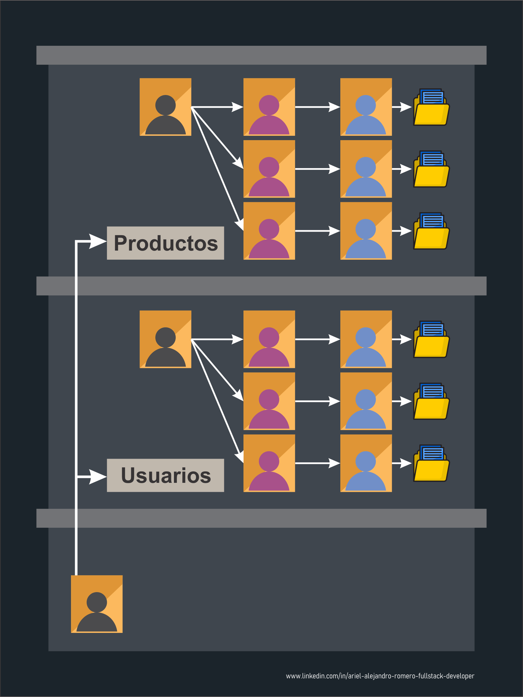

# Nest JS - Fundamentals I

[Volver a Inicio](../../README.md)

## Links

- [NestJS - Documentación Oficial](https://nestjs.com/)

## Scaffolding

### Enfoque Modular

- Organiza el proyecto en carpetas que representan roles o componentes claves.
- Las carpetas contienen archivos que se centran en una función específica.

```txt
  src/
    |-- controllers/
    |-- modules/
    |-- services/
```

### Enfoque Funcional (el recomendado en Nest JS)

- Organiza tu proyecto en carpetas que representan características específicas del proyecto.

```txt
  src/
    |-- auth/
    |-- products/
    |-- users/
```

## Nest JS

- NestJS es un framework para construir aplicaciones backend eficientes y escalables con Node.js.

- Usa JavaScript moderno y está completamente construido con TypeScript (aunque también permite usar JS puro).

- Combina conceptos de POO, Programación Funcional (FP) y Programación Funcional Reactiva (FRP).

- Funciona sobre Express (por defecto) o Fastify (opcional).

- Proporciona una arquitectura predefinida para crear aplicaciones escalables, mantenibles y testeables.

- Inspirado fuertemente en la arquitectura de Angular.

- Nest abstrae Express/Fastify, pero permite acceso directo a sus APIs y a módulos de terceros de Node.

- Se recomienda iniciar proyectos con el CLI de Nest:

```bash
npm i -g @nestjs/cli  # Instalar CLI de NestJS en forma global
nest new project-name # Inicializar un nuevo proyecto de NestJS
```

- Una vez iniciado, puedes ver tu app en http://localhost:3000/.

- También puedes iniciar un proyecto clonando desde GitHub o configurándolo manualmente.

## Módulos, Controladores y Servicios en NestJS - Un Ejemplo



## Módulos en Nest JS


## Inyección de Dependencias


## Request, Módulos, Controladores y Servicios


## Módulos, Controladores y Servicios


### 🎯Resumen

- Los MÓDULOS son CLASES definidas mediante el decorador @Module que actúan como unidades organizativas dentro de la aplicación.
  - Utilizan Servicios, Controllers e incluso otros Módulos creando una unidad independiente y autónoma.
- Los CONTROLLERS son clases que reciben las solicitudes entrantes
  - Manejan una ruta específica, evalúan el método HTTP.
  - Desestructuran la Información Recibida
  - Invocan al SERVICIO correspondiente
  - Devuelven la respuesta al cliente.
  - Debemos declararlos en los Módulos.
- Los SERVICIOS son los responsables de la lógica de negocios y las operaciones de datos (MÉTODOS), con el propósito de que puedan ser reutilizados por diversos controladores.
  - Son usados por los CONTROLADORES
    Debemos declararlos en los MÓDULOS

## Comandos de la CLI de Nest JS (Commmand Line Interface)

### Inicializar proyecto de Nest (Sin CLI Global)

```bash
npx @nestjs/cli new nest-demo

cd nest-demo

# Para correr proyecto de Nest:
npm run start
# Para actualizar servidor ante un cambio en el código
npm run start:dev
# Cortar servidor:
"Ctrl + c"
```

### Instalación de CLI de forma global

```bash
npm install -g @nestjs/cli

# Obtener listado de dependencias globales:
npm list -g --depth=0

# Desinstalar una dependencia global:
npm uninstall -g @nestjs/cli
```

### Inicializar proyecto de Nest

```bash
nest new nest-demo

cd nest-demo

# Para correr proyecto de Nest:
npm run start
# Para actualizar servidor ante un cambio en el código
npm run start:dev
# Cortar servidor:
"Ctrl + c"
```

### Comandos Generales

```bash
nest generate <comando>
nest g <comando>
```

### Ayuda

```bash
nest -h
nest g -h
nest g s nombre -h
```

### Componentes

```bash
# Crear un Controlador:
nest g co <path/nombre>

# Crear un Decorador:
nest g d <path/nombre>

# Crear un Guardián:
nest g gu <path/nombre>

# Crear un Interceptor:
nest g in <path/nombre>

# Crear un Módulo:
nest g mo <path/nombre>

# Crear un Pipe:
nest g pi <path/nombre>

# Crear un Service:
nest g s <path/nombre>

# Crear un Recurso Completo:
nest g resource <path/nombre>

# Crear un Middleware:
nest g middleware <path/nombre>
```

### Banderas (Flags)

```bash
# Crear en modo plano:
nest g co <path/nombre> --flat

# No crear archivo de Test:
nest g co <path/nombre> --no-spec
```

## Middlewares

- Un Middleware es una función de paso (intermediaria)
  - Tiene acceso a "Req" y "Res"
  - Se ejecuta previo a que la solicitud llegue al endpoint
- Pueden crearse en una carpeta "./src/middlewares", ó dentro de la carpeta de la entidad correspondiente si forma parte exclusiva de un módulo.
- En Nest JS puede crearse de forma manual o mediante la CLI

## Sobre LF y CRLF

> LF (Line Feed) y CRLF (Carriage Return + Line Feed) son secuencias de control utilizadas en sistemas informáticos para representar el final de una línea de texto.

### LF (Line Feed)

Es un carácter de control que se utiliza para indicar el final de una línea de texto en sistemas Unix y Unix-like (como Linux y macOS). En ASCII, el código de LF es 10 (0x0A en hexadecimal). Cuando se encuentra un LF, el cursor de escritura se mueve a la siguiente línea.

### CRLF (Carriage Return + Line Feed)

Es una combinación de dos caracteres de control que se utiliza para indicar el final de una línea de texto en sistemas Windows y DOS. El Carriage Return (retorno de carro) es un carácter que mueve el cursor al principio de la línea, y el Line Feed es el carácter que indica el final de la línea. En ASCII, el código de Carriage Return es 13 (0x0D) y el código de Line Feed es 10 (0x0A).

### En resumen

LF se utiliza en sistemas Unix para indicar el final de una línea de texto, mientras que CRLF se utiliza en sistemas Windows y DOS para el mismo propósito. Estas diferencias en el manejo de los saltos de línea a veces pueden causar problemas de compatibilidad al trabajar con archivos de texto en diferentes sistemas operativos.

### ✅Solución: `endOfLine: 'auto'` en `eslint.config.mjs`:

- Deja que **Prettier detecte el estilo de línea según el sistema operativo** (LF en Unix/macOS/Linux, CRLF en Windows).
- Al incluirlo como regla de ESLint (`'prettier/prettier'`), **unifica formato y lint** y evita errores.
- Esta opción **minimiza conflictos** al trabajar en equipo en diferentes sistemas.
- Es ideal para proyectos multiplataforma y colaborativos.
- En ARCHIVO "eslint.config.mjs":

```js
// ARCHIVO eslint.config.mjs
// ----- IMPORTS -----

export default tseslint.config(
  // ----- ----- ----- -----
  {
    rules: {
      "@typescript-eslint/no-explicit-any": "off",
      "@typescript-eslint/no-floating-promises": "warn",
      "@typescript-eslint/no-unsafe-argument": "warn",
      "prettier/prettier": [
        "error",
        {
          endOfLine: "auto",
        },
      ],
    },
  }
);
```

[Volver a Inicio](../../README.md)
